```mermaid
flowchart LR
    Ingest["📥 Ingest & Collect<br/><sub>Airbyte • Fivetran • dlt • Selenium • BeautifulSoup</sub>"] --> Store["🛢️ Store & Manage<br/><sub>Snowflake • BigQuery • Databricks • Postgres • MongoDB</sub>"]
    Store --> Transform["🔄 Transform<br/><sub>dbt • Apache Spark • SQL</sub>"]
    Transform --> Orchestrate["⚙️ Orchestrate<br/><sub>Airflow • Dagster • Mage • Kestra</sub>"]
    Orchestrate --> Quality["🛡️ Data Quality<br/><sub>Great Expectations • Soda • dbt Tests</sub>"]
    Quality --> Governance["🏷️ Governance & Catalog<br/><sub>Bruin • OpenMetadata & dbt Docs</sub>"]
    Governance --> BI["📊 BI & Analytics<br/><sub>Power BI • Looker Studio • Superset • Metabase</sub>"]

    CICD["🚀 CI/CD & GitOps<br/><sub>Git • GitHub Actions • GitLab CI</sub>"] -.-> Transform
    CICD -.-> Orchestrate

    %% Styling nodes
    style Ingest fill:#0f172a,stroke:#38bdf8,stroke-width:2px,color:#f8fafc
    style Store fill:#0f172a,stroke:#c084fc,stroke-width:2px,color:#f8fafc
    style Transform fill:#0f172a,stroke:#fb7185,stroke-width:2px,color:#f8fafc
    style Orchestrate fill:#0f172a,stroke:#f59e0b,stroke-width:2px,color:#f8fafc
    style Quality fill:#0f172a,stroke:#ec4899,stroke-width:2px,color:#f8fafc
    style Governance fill:#0f172a,stroke:#6366f1,stroke-width:2px,color:#f8fafc
    style BI fill:#0f172a,stroke:#34d399,stroke-width:2px,color:#f8fafc
    style CICD fill:#0f172a,stroke:#14b8a6,stroke-width:2px,color:#f8fafc
```

<div align="center">
  
</div>

<p align="center">
  
</p>

<p align="center">
  <a href="mailto:tunguyen150599@gmail.com"></a>&nbsp;
  <a href="https://www.linkedin.com/in/tunguyenn99"></a>&nbsp;
  <a href="https://tunguyenn99-portfolio.vercel.app/"></a>
</p>


```yaml
senior_analytics_engineer:
  philosophy: "Turning raw data complexity into clean, version-controlled business truths."
  mission: "Bridging the gap between software engineering best practices and high-impact business analytics."
  core_competencies:
    ingestion_orchestration:
      - "Building automated pipelines via Airbyte, dlt, and custom crawlers"
      - "Orchestrating robust workflow DAGs using Apache Airflow and Dagster"
    transformation_modeling:
      - "Architecting modular, optimized, and test-proven dbt pipelines"
      - "Converting raw database schemas into clean, analytical star-schemas"
    data_trust_governance:
      - "Enforcing automated data quality tests using dbt tests and Great Expectations"
      - "Maintaining metadata lineage and definitions using Bruin CLI and OpenMetadata"
    bi_analytics:
      - "Designing high-performance Power BI, Superset, and Looker Studio dashboards"
      - "Translating complex datasets into actionable metrics for business growth"
```


<div align="center">
  <table width="100%">
    <tr>
      <td align="center" valign="top" width="13%">
        <sub>Nov 2021 - Apr 2023</sub><br /><br />
        <br /><br />
        <a href="https://shopee.vn/"><b>Shopee</b></a><br />
        <sub>PMO</sub>
      </td>
      <td align="center" valign="middle" width="1%">➔</td>
      <td align="center" valign="top" width="13%">
        <sub>Apr 2023 - Sep 2025</sub><br /><br />
        <br /><br />
        <a href="https://vnpay.vn/"><b>VNPAY</b></a><br />
        <sub>Data Analyst</sub>
      </td>
      <td align="center" valign="middle" width="1%">➔</td>
      <td align="center" valign="top" width="13%">
        <sub>Apr 2025 - </sub><br /><br />
        <br /><br />
        <a href="https://www.facebook.com/xomdata"><b>Xóm Data</b></a><br />
        <sub>Founder</sub>
      </td>
      <td align="center" valign="middle" width="1%">➔</td>
      <td align="center" valign="top" width="13%">
        <sub>Sep 2025 - Jun 2026</sub><br /><br />
        <br /><br />
        <a href="https://www.tnex.com.vn/"><b>TNEX</b></a><br />
        <sub>Sr. Data Analyst</sub>
      </td>
      <td align="center" valign="middle" width="1%">➔</td>
      <td align="center" valign="top" width="13%">
        <sub>Jan 2026 - </sub><br /><br />
        <br /><br />
        <a href="https://upbase.asia/"><b>UpBase</b></a><br />
        <sub>Data Analytics Engineer</sub>
      </td>
      <td align="center" valign="middle" width="1%">➔</td>
      <td align="center" valign="top" width="13%">
        <sub>Feb 2026 - </sub><br /><br />
        <br /><br />
        <a href="https://hvgroup.com.vn/"><b>HV HOLDINGS</b></a><br />
        <sub>Analytics Engineer</sub>
      </td>
      <td align="center" valign="middle" width="1%">➔</td>
      <td align="center" valign="top" width="13%">
        <sub>Jun 2026 - </sub><br /><br />
        <br /><br />
        <a href="https://www.gpbank.com.vn/"><b>GPBank</b></a><br />
        <sub>Senior Analytics Engineer</sub>
      </td>
    </tr>
  </table>
</div>




<br/>

<div align="center">
  <h3>🛠️ Tech Stack &amp; Reference Logos</h3>
  <table width="100%">
    <tr>
      <td width="25%"><b>📥 Ingest &amp; Collect</b></td>
      <td width="75%">
        
        
        
        
        
        
        
      </td>
    </tr>
    <tr>
      <td><b>🛢️ Store &amp; Manage</b></td>
      <td>
        
        
        
        
        
        
        
        
        
        
      </td>
    </tr>
    <tr>
      <td><b>🔄 Transform</b></td>
      <td>
        
        
      </td>
    </tr>
    <tr>
      <td><b>⚙️ Orchestrate</b></td>
      <td>
        
        
        
        
      </td>
    </tr>
    <tr>
      <td><b>🛡️ Data Quality</b></td>
      <td>
        
        
        
      </td>
    </tr>
    <tr>
      <td><b>🏷️ Governance &amp; Catalog</b></td>
      <td>
        
        
        
      </td>
    </tr>
    <tr>
      <td><b>📊 BI &amp; Analytics</b></td>
      <td>
        
        
        
        
        
        
      </td>
    </tr>
    <tr>
      <td><b>🚀 CI/CD &amp; GitOps</b></td>
      <td>
        
        
        
      </td>
    </tr>
    <tr>
      <td><b>📋 Project &amp; Knowledge</b></td>
      <td>
        
        
        
        
      </td>
    </tr>
    <tr>
      <td><b>💻 IDE &amp; Data Tools</b></td>
      <td>
        
        
        
      </td>
    </tr>
  </table>
</div>


<div align="center">
  <table border="0" style="border-collapse: collapse; border: none;">
    <tr style="border: none;">
      <!-- Cột trái: Contribution Cityscape (To hơn) -->
      <td width="58%" align="center" style="border: none; padding: 10px;" valign="middle">
        
      </td>
      <!-- Cột phải: GitHub Stats trên, Top Languages dưới -->
      <td width="42%" align="center" style="border: none; padding: 10px;" valign="middle">
        
        <br /><br />
        
      </td>
    </tr>
  </table>
</div>


### 🔍 Weekly Progress Query

```sql
-- Fetching coding metrics from the last 7 days
SELECT 
  language, 
  time_spent, 
  intensity_bar, 
  percentage 
FROM weekly_progress 
ORDER BY time_spent DESC;
```

#### 🖥️ Query Results:

<!--START_SECTION:waka-->

```txt
YAML         2 hrs 13 mins         ███████████████░░░░░░░░░░   59.38 %
Markdown     1 hr 16 mins          ████████▓░░░░░░░░░░░░░░░░   34.19 %
Bash         6 mins                ▓░░░░░░░░░░░░░░░░░░░░░░░░   02.97 %
Other        6 mins                ▓░░░░░░░░░░░░░░░░░░░░░░░░   02.80 %
Git Config   1 min                 ░░░░░░░░░░░░░░░░░░░░░░░░░   00.64 %
```

<!--END_SECTION:waka-->


### 🧩 GET /api/v1/fun-facts

```json
{
  "status": "Open for Collaboration",
  "hobbies": ["Data Storytelling", "Automating Everything", "Modern Data Stack"],
  "favorite_stack": ["dbt", "Airflow", "Power BI"],
  "coffee_conversion_rate": "1 cup ➔ 1000 lines of code",
  "fun_fact": "Started with Chemistry, now bonding with Data Points"
}
```


<div align="center">
  
</div>